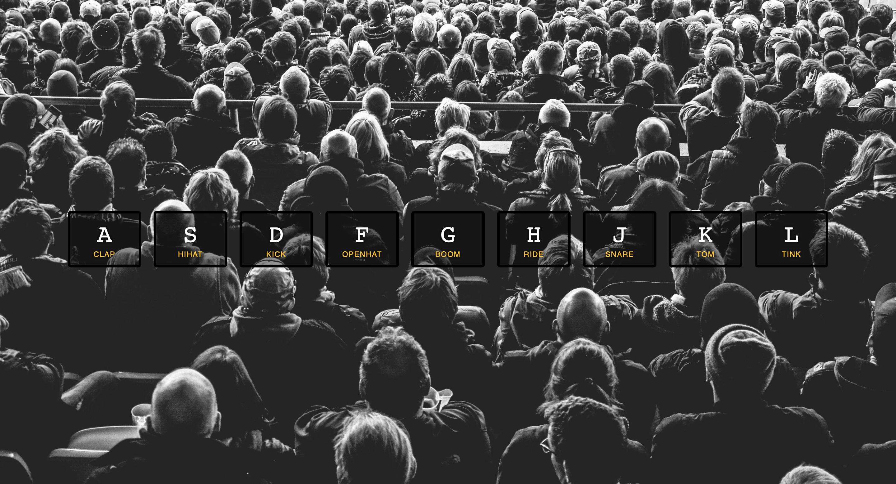
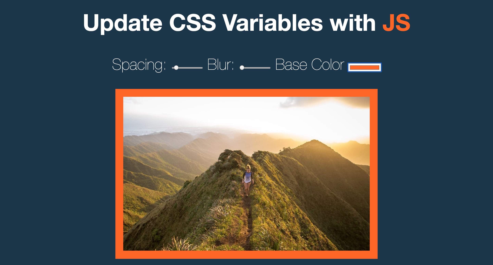
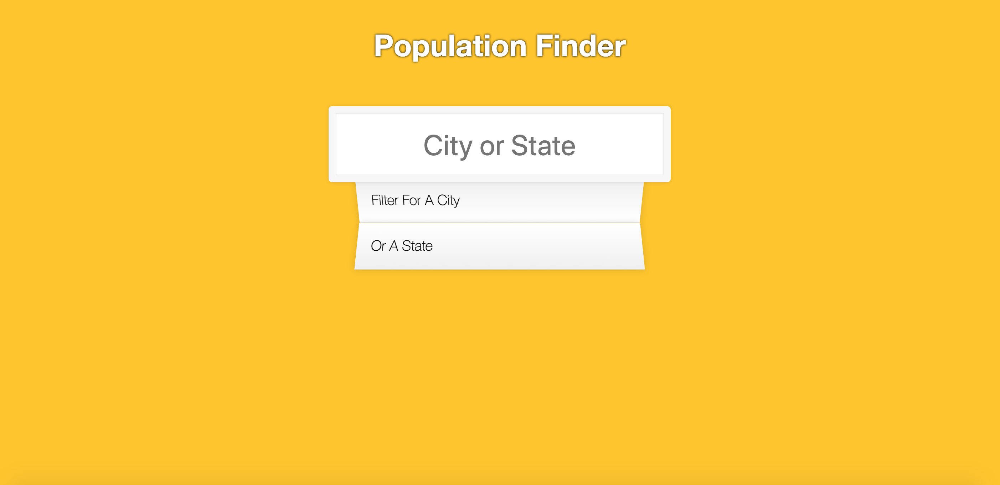
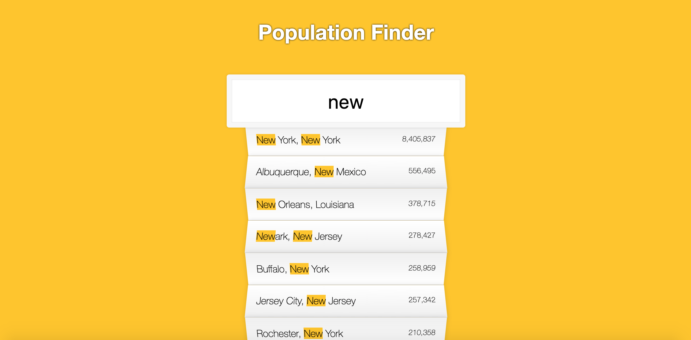

## JavaScript30 By [Wes Bos](javascript30.com)

30 vanilla JS coding challenges by [Wes Bos](javascript30.com)

| Challenge | Picture|
| --------- | ------ |
| 1.Drum Kit| |
| 2. Clock |  |
| 3. CSS variables & updating at runtime |  |
| 4. Array Cardio Day 1 | Console only learning different functions to use on arrays (map, filter, reduce, sort) |
| 5. Flex Panels Image Gallery |   |
| 6. Population - Ajax Type Ahead |   |
| 7. Array Cardio Day 2 | Console only learning different functions to use on arrays (some, every, find, findIndex, deleting) |