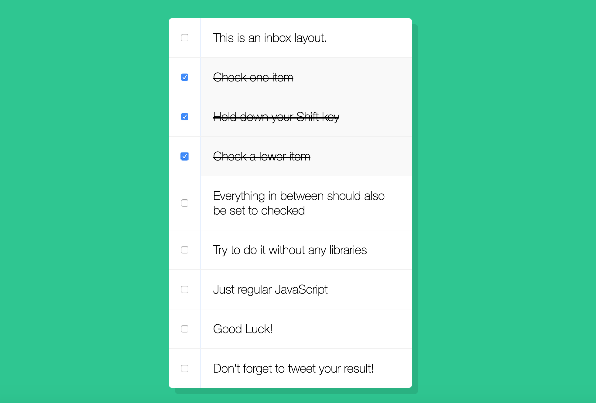
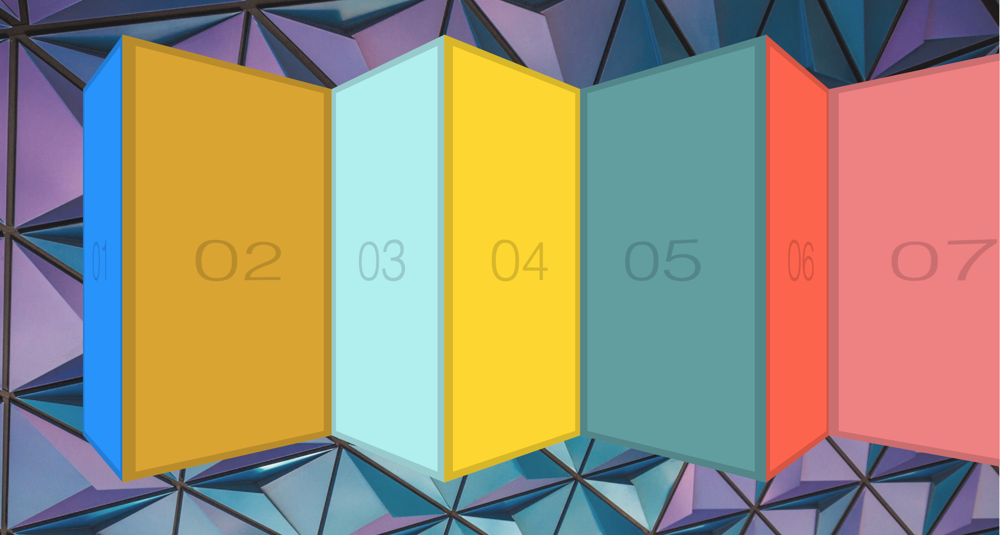

## JavaScript30 By [Wes Bos](javascript30.com)

30 vanilla JS coding challenges by [Wes Bos](javascript30.com)

| Challenge | Picture|
| --------- | ------ |
| 1.Drum Kit| |
| 2. Clock |  |
| 3. CSS variables & updating at runtime |  |
| 4. Array Cardio Day 1 | Console only learning different functions to use on arrays (map, filter, reduce, sort) |
| 5. Flex Panels Image Gallery |   |
| 6. Population - Ajax Type Ahead |   |
| 7. Array Cardio Day 2 | Console only learning different functions to use on arrays (some, every, find, findIndex, deleting)|
| 8.HTML5 Canvas |   |
| 9. Dev Tool Tricks |   |
| 10. Hold shift to check multiple checkboxes |  |
| 11. Custom HTML5 Video Player |  |
| 12. Key Sequence Detection |   |
| 13. Slide In on Scroll |   |
| 14. Objects and Arrays | Learned different methods of copying objects and arrays |
| 15. LocalStorage and Event Delegation |   |
| 16. CSS Text Shadow Mouse Move Effect |    |
| 17. Sorting without articles |  |
| 18. Tally String Times With Reduce | Used reduce to total the total video times |
| 19. Unreal Webcam Fun |  |
| 20. Native Speech Recognition |  |
| 21. Geolocation based Speedometer and Compass |  |
| 22. Follow Along Links |   |
| 23. Speech synthesis |   |
| 24. Sticky Nav |   |
| 25 - Event capture, Propagation, Bubbling and Once | Used nested elements to learn about events firing and different options we can use to control them |
| 26. Stripe Follow Along Dropdown |    |
| 27. Click and Drag to Scroll |  |